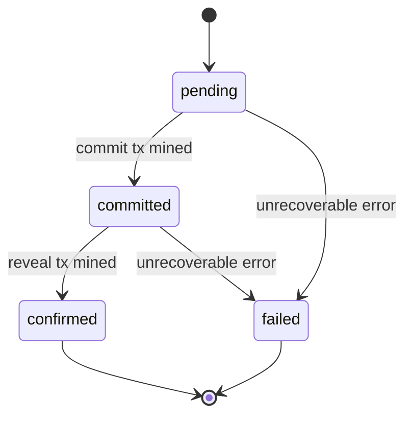

# Attestations

## Create an Attestation

```
POST /v1/attestations
```

Certifies a piece of content. Computes its IPFS CID, records a `pending` attestation, and queues the [commit/reveal](../standard/taanq/commit-reveal.md) transactions. This call returns immediately and **does not wait for the chain.**

### Request Body

```json
{
  "content": "The full plain-text body of the article...",
  "chainId": 11155111,
  "url": "https://example-news.com/articles/some-story",
  "metadata": { "author": "Jane Doe" }
}
```

| Field | Type | Required | Description |
|---|---|---|---|
| `content` | `string` | Yes | The exact plain-text content to attest. The IPFS CID and quote-verification hash are derived from this string — any change (even whitespace) produces a different CID. |
| `chainId` | `number` | No | Chain to publish on. Falls back to your organization's default chain, then the API's own default. `400` if none can be resolved. |
| `url` | `string` | No | Canonical URL of the published article. |
| `metadata` | `object` | No | Arbitrary free-form data stored alongside the attestation (not sent on-chain). |

### Response

`202 Accepted` for a new attestation:

```json
{
  "id": "b3e1a6b0-6e77-4e37-9f0b-1a1a2f9d9c11",
  "status": "pending",
  "contentCid": "bafkreifzjut3te2nhyekklss27nh3k72ysco7y32koao5eei66wof36n5e",
  "chainId": 11155111,
  "authorityAddress": "0xD2f2c95962632B4742703CC058889c624380C748"
}
```

| Field | Type | Description |
|---|---|---|
| `id` | `string (uuid)` | Identifier for polling this attestation's status. |
| `status` | `string` | One of `pending`, `committed`, `confirmed`, `failed`. See [status lifecycle](#status-lifecycle). |
| `contentCid` | `string` | The IPFS CID computed from `content`. |
| `chainId` | `number` | The chain the attestation will be published on. |
| `authorityAddress` | `string` | Your organization's authority address this attestation is attributed to. |

!!! note "Idempotent by content"
    Submitting identical `content` for the same publisher and `chainId` again does **not** create a duplicate. The existing attestation is returned instead, with HTTP `200` (not `202`). This makes it safe to retry a request after a network error without double-publishing.

If the content is found to already be attested on-chain under your authority (e.g. published through another tool), the response is returned with `status: "confirmed"` and `200`, and no background work is queued.

---

## Get an Attestation

```
GET /v1/attestations/:id
```

Returns the current state of a single attestation. Use this to poll after receiving a `202`.

### Response

```json
{
  "id": "b3e1a6b0-6e77-4e37-9f0b-1a1a2f9d9c11",
  "url": "https://example-news.com/articles/some-story",
  "chainId": 11155111,
  "authorityAddress": "0xD2f2c95962632B4742703CC058889c624380C748",
  "contentCid": "bafkreifzjut3te2nhyekklss27nh3k72ysco7y32koao5eei66wof36n5e",
  "status": "confirmed",
  "commitTxHash": "0x1234...",
  "revealTxHash": "0xabcd...",
  "attestationIndex": 4,
  "error": null,
  "createdAt": "2026-08-01T19:52:58.304Z",
  "confirmedAt": "2026-08-01T19:54:31.912Z"
}
```

`attestationIndex` is set once `status` is `confirmed`, and together with `contentCid`, `chainId`, and `authorityAddress` forms a complete [attestation reference](../standard/index.md#attestations) that can be independently verified.

A request for an attestation belonging to another publisher, or an unrecognized `id`, returns `404`.

---

## List Attestations

```
GET /v1/attestations?limit=50
```

Returns attestations for your organization, newest first.

| Query param | Default | Max | Description |
|---|---|---|---|
| `limit` | `50` | `200` | Number of results to return. |

### Response

```json
{
  "attestations": [
    { "id": "...", "status": "confirmed", "...": "..." }
  ]
}
```

Each entry has the same shape as [Get an Attestation](#get-an-attestation).

---

## Status Lifecycle



| Status | Meaning |
|---|---|
| `pending` | Accepted, not yet submitted on-chain. |
| `committed` | The commit transaction has been mined; waiting out the reveal delay (~60s). |
| `confirmed` | The reveal transaction has been mined. `attestationIndex` is now set and the attestation is publicly verifiable. |
| `failed` | Certification could not complete — see `error` for details. Failures are not retried automatically; see [Errors](errors.md). |
