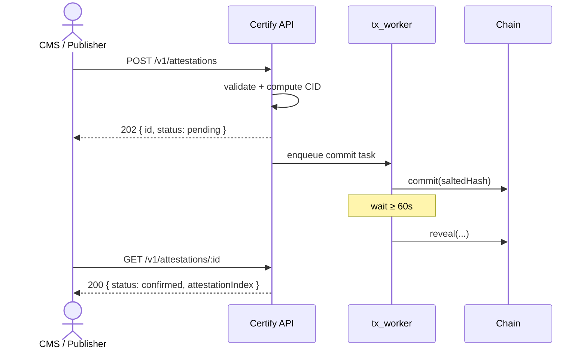

# Indelible Certify API

The Indelible Certify API is a hosted HTTP service that lets publishers certify articles with the [Indelible Standard](../standard/index.md) without running any blockchain infrastructure themselves. You send it an API key and some content; it computes the content's IPFS CID, queues the [commit/reveal](../standard/taanq/commit-reveal.md) transactions, and signs them with a platform key to which your organization has [delegated](../standard/taanq/delegations.md).

**This is NOT a blocking API.** A request to create an attestation is validated, written to a `pending` row, and returns `202 Accepted` immediately. A separate worker process signs, submits, and confirms the transactions in the background. Poll for status or wait for confirmation asynchronously.

---

## Before You Start

Every attestation is attributed to your organization's **authority address,** the wallet you control. The platform key never becomes the author; it only pays gas and submits transactions on your behalf, via an on-chain [delegation](../standard/taanq/delegations.md).

Onboarding therefore has one prerequisite outside the API itself: your authority address must call `delegate(platformAddress)` on the TAANQ contract for each chain you intend to publish on. Your Indelible contact will give you the platform address to delegate to and confirm once the delegation is verified - requests made before that will fail with [`409 no_active_delegation`](errors.md).

!!! tip "Want to get started?"
    Reach out to [Indelible](https://indelible.world) for your API key and more information.
    

Continue to:

- [Authentication](authentication.md) — API keys and request signing.
- [Attestations](attestations.md) — creating and polling attestations.
- [Errors](errors.md) — error codes and how to handle them.
