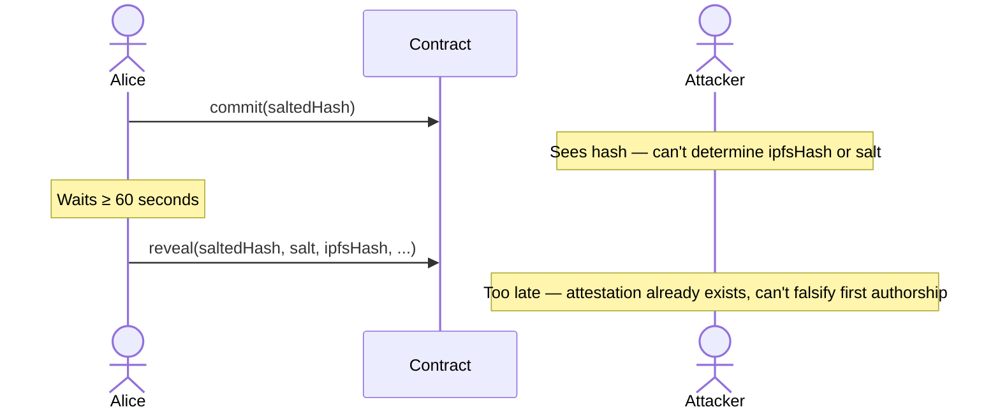

# TAANQ Commit/Reveal

Creating an attestation uses a **commit/reveal scheme** to prevent front-running. Without it, a bad actor watching the mempool could see an incoming attestation transaction and immediately submit their own with a higher gas fee, effectively stealing authorship credit for content they didn't create.

---

## Front-Running

On a public blockchain, all pending transactions are visible in the mempool before they are mined. If attestation were a single transaction, an attacker could:

1. See `alice.eth` submit `attest(ipfsHash)` in the mempool.
2. Submit an identical `attest(ipfsHash)` with a higher gas price.
3. Have their transaction mined first, claiming authorship of Alice's content.

The commit/reveal scheme closes this window.

??? danger "Without commit/reveal — attacker wins"

    ```mermaid
    sequenceDiagram
        actor Alice
        participant Contract
        actor Attacker

        Alice->>Contract: attest(ipfsHash)
        Note over Attacker: Sees ipfsHash in mempool
        Attacker->>Contract: attest(ipfsHash) with higher gas
        Note over Contract: Attacker's tx mines first — attestation created
        Note over Alice: Already attested, can't claim first authorship
    ```

---

## How It Works



Because the commitment only exposes a hash, an attacker in the mempool cannot reconstruct the `ipfsHash` or `salt` needed to front-run the reveal.

---

## Step 1 — Commit

```solidity
function commit(bytes32 saltedHash) external
```

Before attesting, compute a salted hash of the content you intend to attest and submit it on-chain.

```
saltedHash = keccak256(abi.encodePacked(ipfsHash, bytes32(bytes20(msg.sender)), salt))
```

| Parameter | Description |
|---|---|
| `saltedHash` | The keccak256 hash of `(ipfsHash, address, salt)`. |

The contract records `commits[msg.sender][saltedHash] = block.timestamp`. A commit cannot be overwritten — if the same hash is submitted twice the transaction reverts with `"Commit already exists"`.

**Keep the `salt` secret** until you call `reveal()`. The salt is what prevents an attacker from reverse-engineering `ipfsHash` from the public commitment.

---

## Step 2 — Wait

After the commit is mined, wait at least **60 seconds** (`DEFAULT_REVEAL_TIMER`) before calling `reveal()`. This delay exists so that the commitment timestamp is safely in the past and cannot be manipulated by miner timestamp variance.

> Block timestamps on most chains can be slightly influenced by validators. A 60-second gap is far beyond any realistic timestamp drift, ensuring the commit timestamp is reliable.

---

## Step 3 — Reveal

```solidity
function reveal(
    bytes32 saltedHash,
    bytes32 salt,
    bytes32 ipfsHash,
    bytes32 qvHash,
    bytes32 parentIpfsHash,
    address authority
) external
```

The contract re-computes the hash from the provided inputs and verifies it matches the stored commitment:

```solidity
bytes32 userProvidedHash = keccak256(abi.encodePacked(ipfsHash, bytes32(bytes20(msg.sender)), salt));
require(userProvidedHash == saltedHash, "Hash invalid");
```

It then checks that the commit is at least 60 seconds old and creates the [attestation](attestations.md).

On success, the commit entry is deleted from storage, returning a gas refund.

---

## Commit Storage

```solidity
mapping(address => mapping(bytes32 => uint256)) commits;
```

Commits are stored as `address → saltedHash → timestamp`. The mapping is private — commits cannot be read directly. The only way to validate a commit is through `reveal()`, which deletes the entry after use.